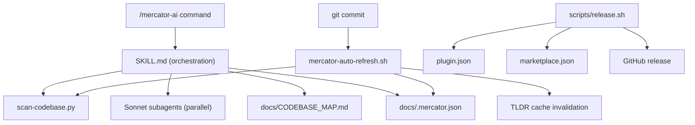
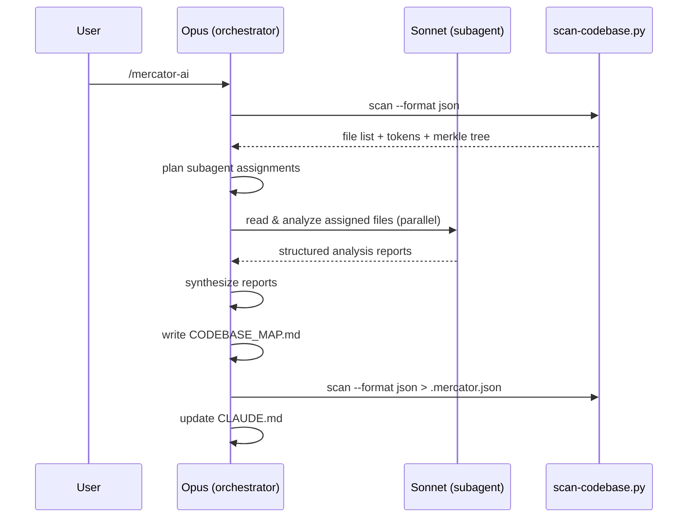
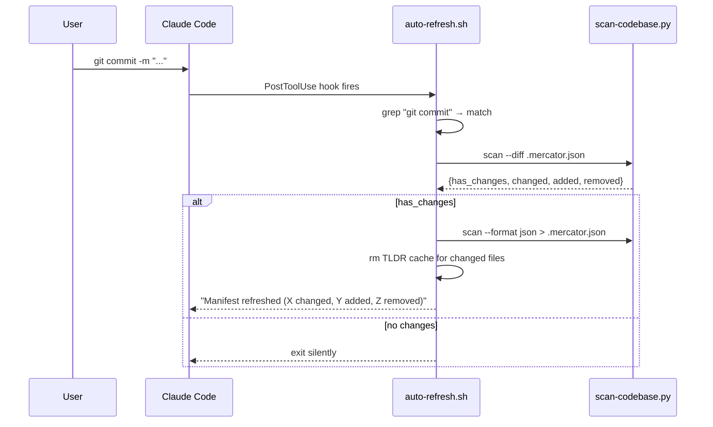

# Codebase Map

> Auto-generated by Mercator AI. Last mapped: 2026-02-13T18:59:48Z

## System Overview

Mercator AI is a Claude Code plugin that maps codebases using parallel Sonnet subagents with Merkle-tree change detection. It has a two-tier repo layout: a marketplace wrapper at the root and the actual plugin nested in `plugins/mercator-ai/`.



## Directory Structure

```
mercator-ai/                          # Marketplace repo wrapper
├── .claude-plugin/
│   └── marketplace.json              # Plugin registry entry for discovery
├── plugins/
│   └── mercator-ai/                  # Actual plugin root
│       ├── .claude-plugin/
│       │   └── plugin.json           # Plugin manifest + hook registration
│       ├── docs/
│       │   └── MAP_FIRST_PROTOCOL.md # Agent exploration protocol spec
│       ├── hooks/
│       │   └── mercator-auto-refresh.sh  # Post-commit merkle refresh
│       ├── skills/
│       │   └── mercator-ai/
│       │       ├── SKILL.md          # Full mapping workflow instructions
│       │       └── scripts/
│       │           └── scan-codebase.py  # Core scanner (tokens + hashes)
│       ├── ATTRIBUTION.md            # Credits to Bootoshi's Cartographer
│       └── LICENSE                   # MIT dual copyright
├── scripts/
│   └── release.sh                    # Semver bump + GitHub release
├── .gitignore
└── README.md                         # User-facing docs
```

## Module Guide

### Marketplace Wrapper (root)

**Purpose**: Registers the plugin in the Claude Code plugin marketplace.

| File | Purpose | Tokens |
|------|---------|--------|
| `.claude-plugin/marketplace.json` | Plugin registry pointing to `./plugins/mercator-ai` | 253 |
| `README.md` | Installation, usage, feature comparison with Cartographer | 1,828 |
| `scripts/release.sh` | Automated version bumping, git tagging, GitHub releases | 1,122 |
| `.gitignore` | Python bytecode + venv exclusions | 32 |

**Dependencies**: `jq`, `gh` CLI, `git` (for `release.sh`)

### Plugin Core (`plugins/mercator-ai/`)

**Purpose**: The actual plugin that Claude Code loads and runs.

| File | Purpose | Tokens |
|------|---------|--------|
| `.claude-plugin/plugin.json` | Plugin manifest; registers PostToolUse:Bash hook | 230 |
| `ATTRIBUTION.md` | Credits original Cartographer, lists enhancements | 407 |
| `LICENSE` | MIT dual copyright (Bootoshi 2025, shihwesley 2026) | 263 |

**Exports**: Hook registration (PostToolUse on Bash tool calls)

### Scanner (`plugins/mercator-ai/skills/mercator-ai/scripts/`)

**Purpose**: Python script that walks the filesystem, counts tokens via tiktoken, builds a SHA-256 merkle tree, and supports `--diff` mode for O(1) change detection.

| File | Purpose | Tokens |
|------|---------|--------|
| `scan-codebase.py` | File tree walker, token counter, merkle hasher, diff engine | 4,068 |

**Key functions**:
- `scan_directory()` — returns files, tokens, merkle tree
- `diff_merkle()` — compares two merkle trees, returns changed/added/removed
- `format_tree()` — human-readable tree output

**Dependencies**: `tiktoken` (auto-installed via UV PEP 723 inline metadata)

**Output formats**: `json`, `tree`, `compact`, `merkle`

### Skill Definition (`plugins/mercator-ai/skills/mercator-ai/`)

**Purpose**: Orchestration instructions that tell Claude how to run the full mapping workflow.

| File | Purpose | Tokens |
|------|---------|--------|
| `SKILL.md` | 9-step mapping workflow, subagent strategy, output format spec | 2,274 |

**Key rule**: Opus orchestrates, Sonnet reads. Opus never reads source files directly.

### Auto-Refresh Hook (`plugins/mercator-ai/hooks/`)

**Purpose**: Fires after every `git commit`, refreshes merkle hashes, invalidates TLDR cache for changed files.

| File | Purpose | Tokens |
|------|---------|--------|
| `mercator-auto-refresh.sh` | Post-commit hook: diff → refresh manifest → invalidate TLDR | 993 |

**Dependencies**: `python3`, `jq`, `scan-codebase.py`

**Cost**: ~2 seconds of Python, zero API tokens.

### Protocol Doc (`plugins/mercator-ai/docs/`)

**Purpose**: Tells agents to read the map before scanning a codebase blindly.

| File | Purpose | Tokens |
|------|---------|--------|
| `MAP_FIRST_PROTOCOL.md` | Mandatory exploration protocol: read map first, Glob/Grep second | 837 |

## Data Flow

### Full Mapping



### Post-Commit Auto-Refresh



## Conventions

- **Version sync**: `marketplace.json` and `plugin.json` versions must match. `release.sh` handles this.
- **Hash truncation**: SHA-256 truncated to 12 hex chars throughout.
- **Merkle combination**: `sha256(sorted(child_hashes))` — order-independent.
- **Token counting**: Uses `cl100k_base` encoding (may differ slightly from actual model tokenizer).
- **Plugin root variable**: `${CLAUDE_PLUGIN_ROOT}` set by Claude Code runtime, used for locating hook scripts.
- **UV over pip**: Scanner uses PEP 723 inline deps for zero-global-pollution dependency management.

## Gotchas

1. **Hook fires on all Bash calls**, not just git. The script internally filters for `git commit` and exits early otherwise.
2. **Manifest refresh doesn't update architecture prose.** Hash changes are tracked automatically, but added/removed files need a manual `/mercator-ai` run to update the map's narrative sections.
3. **TLDR cache keys use MD5 of absolute paths**, making them machine-specific.
4. **Files >1MB or >50k tokens are skipped** by the scanner (configurable via `--max-tokens`).
5. **Git is not required** for merkle diff — it compares hashes directly on the filesystem.
6. **cl100k_base tokenizer** is GPT-4 era, not latest Claude. Token counts are approximate.

## Navigation Guide

**To release a new version**: Run `scripts/release.sh <patch|minor|major>`. Requires clean working tree, `jq`, and `gh`.

**To modify the mapping workflow**: Edit `plugins/mercator-ai/skills/mercator-ai/SKILL.md`.

**To change what files the scanner ignores**: Edit the ignore patterns in `scan-codebase.py` (~line 30).

**To adjust the post-commit hook behavior**: Edit `plugins/mercator-ai/hooks/mercator-auto-refresh.sh`.

**To update plugin metadata**: Edit both `plugins/mercator-ai/.claude-plugin/plugin.json` and `.claude-plugin/marketplace.json`, or use `release.sh`.
